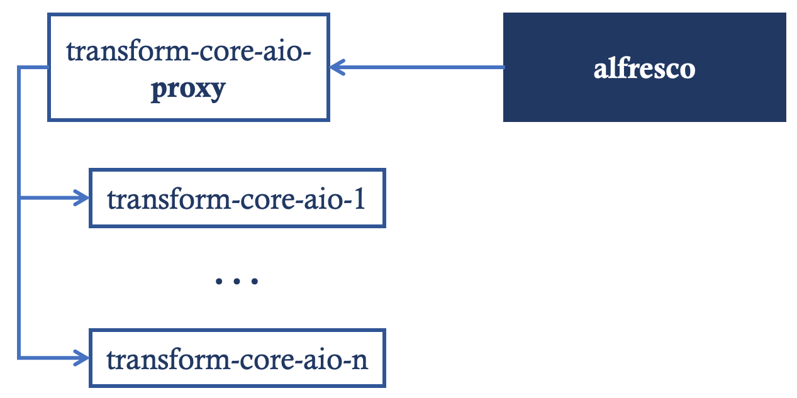
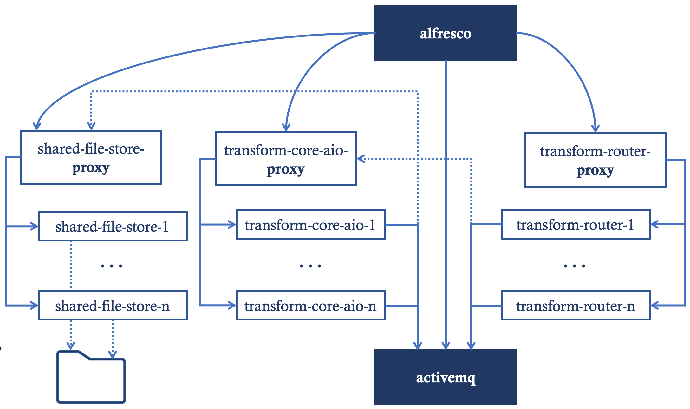

# Quick Alfresco Transformer clusterization guide

This project includes Docker Compose templates providing simple clusterization approach for both Community and Enterprise releases of the [Alfresco Transform Service](https://docs.alfresco.com/transform-service/latest/)

* [acs-community](acs-community) folder includes Docker Compose deployment for ACS Community 7.1
* [acs-enterprise](acs-enterprise) folder includes Docker Compose deployment for ACS Enterprise 7.1

>> Note this is a sample deployment designed for education purposes. When scaling up Alfresco Transform Service in real world, additional requirements should impact in the design of the final deployment.

## Alfresco Transform Service for ACS Community

When using Alfresco Community, Transform Service is a HTTP Endpoint that provides the transformation operations.

Improving availablity or performance may be achieved by adding a Load Balancer Web Proxy in front of a number of `transform-core-aio` services.



The [docker-compose.yml]((acs-community/docker-compose.yml) file includes:

* 2 instances of `transform-core-aio` service (`transform-core-aio-1` and `transform-core-aio-2`)
* 1 instance of NGINX Web Proxy service named as `transform-core-aio-proxy`
* Specific configuration in Alfresco Service with the environment variable `-DlocalTransform.core-aio.url=http://transform-core-aio-proxy/`

NGINX balancer configuration is available in [acs-community/config/nginx-core-aio.conf](acs-community/config/nginx-core-aio.conf) file.

>> This configuration increases Transform Service availability and performance, doubling the resources available to perform transformation operations

## Alfresco Transform Service for ACS Enterprise

When using Alfresco Enterprise, Transform Service includes a number of services:

* *Transform Router* service controls the flow of execution
* *Transform AIO* service executes the transformation operations
* *Shared File Store* service stores *temporarily* input and output files for transformation operations using a filesystem
* *ActiveMQ* is used as communication protocol for the Transform Services

Improving availability or performance may be achieved by adding Load Balancer Web Proxies in front of the Transform Services.



The [docker-compose.yml]((acs-enterprise/docker-compose.yml) file includes:

* 2 instances of `transform-router` service (`transform-router-1` and `transform-router-2`) with 1 instance of NGINX Web Proxy named as `transform-router-proxy`)
* 2 instances of `transform-core-aio` service (`transform-core-aio-1` and `transform-core-aio-2`) with 1 instance of NGINX Web Proxy named as `transform-core-aio-proxy`)
* 2 instances of `shared-file-store` service (`shared-file-store-1` and `shared-file-store-2`) with 1 instance of NGINX Web Proxy named as `shared-file-store-proxy`)
  * Both instances are sharing storage by using a common volume named `shared-file-store-volume`

Configuration for `alfresco`, `transform-router` and `transform-core-aio` are including links to *Web Proxy* services instead of accesing to each instance of Transform Services

NGINX balancer configuration for every service is available in:

* [acs-enterprise/config/nginx-core-aio.conf](acs-community/config/nginx-core-aio.conf)
* [acs-enterprise/config/nginx-core-aio.conf](acs-community/config/nginx-router.conf)
* [acs-enterprise/config/nginx-core-aio.conf](acs-community/config/nginx-shared-file-store.conf)

>> This configuration increases Transform Service availability and performance, doubling the resources available to perform transformation operations

## Scaling up

When designing a deployment strategy to provide High Availability, duplicating services may be a valid approach.

However, when designing a deployment strategy to improve performance, not every service may be duplicated. Additionally, some of the services may require more than 2 instances.

Performing a load test and evaluating resources consumption for every service would help to identify the number of required services for some specific use case.

For instance, you can get those numbers for Docker using following command.

```
$ watch -n 0.1 'docker stats --no-stream --format
"table {{.Name}}\t{{.Container}}\t{{.CPUPerc}}\t{{.MemUsage}}"
| sort -k 1 -h'

NAME                         CONTAINER      CPU %     MEM USAGE / LIMIT
activemq-1                   18ab47a538b8   2.54%     229.4MiB / 1GiB
alfresco-1                   95e6ea8474cb   2.14%     1.26GiB / 1.66GiB
digital-workspace-1          d45ed1bb6066   0.00%     4.996MiB / 128MiB
postgres-1                   be0b57f19faa   0.04%     153.1MiB / 512MiB
proxy-1                      e8697e28b561   0.00%     2.109MiB / 128MiB
share-1                      b08000d2b88d   0.14%     462MiB / 1GiB
shared-file-store-1-1        ccf83b2f0006   0.17%     129.7MiB / 512MiB
shared-file-store-2-1        d7cdc4d57415   0.15%     131.8MiB / 512MiB
shared-file-store-proxy-1    945c694fda08   0.00%     2.141MiB / 19.55GiB
solr6-1                      0c597f2fed85   0.50%     768.4MiB / 2GiB
sync-service-1               c75aba87e15c   0.74%     432.7MiB / 1GiB
transform-core-aio-1-1       a11d81b9d78e   1.16%     377.5MiB / 1.5GiB
transform-core-aio-2-1       a3e2200736b7   1.15%     378.6MiB / 1.5GiB
transform-core-aio-proxy-1   eaeebe7f58f0   0.00%     2.273MiB / 19.55GiB
transform-router-1-1         91a54b89287e   8.69%     265.4MiB / 512MiB
transform-router-2-1         00c875133b1f   4.17%     260.8MiB / 512MiB
transform-router-proxy-1     fac01c065ce3   0.00%     2.23MiB / 19.55GiB
```

## Additional resources

* [Alfresco Transform Service documentation](https://docs.alfresco.com/transform-service/latest/)
* [Alfresco Transform AIO Source Code](https://github.com/Alfresco/alfresco-transform-core)
